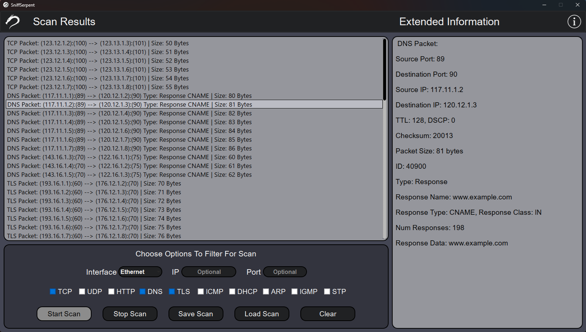
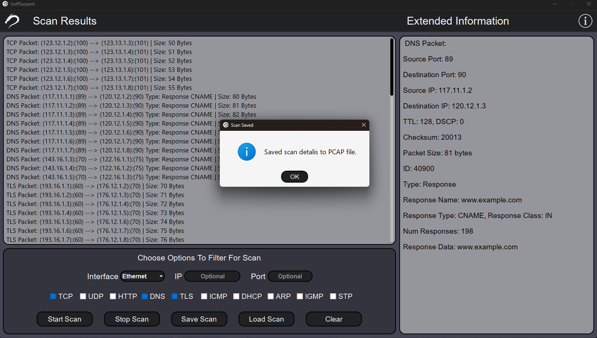

# SniffSerpent - Packet Sniffer

## Overview

SniffSerpent is a powerful network packet analysis tool built with a user-friendly GUI using PyQt and advanced packet capturing techniques using Scapy. It enables you to capture, examine, and analyze different types of network packets. The application currently supports seven packet types: TCP, UDP, HTTP, DNS, TLS, ICMP, DHCP, ARP, IGMP and STP. It also provides insightful details about packets containing IP layers and other packet specific parameters that you can analyze further.

## Clone Repository:

```shell
git clone https://github.com/Shayhha/SniffSerpent
```

## Features

- Captures, analyzes, and visualizes network packets.
- Supports packet types: TCP, UDP, HTTP, DNS, TLS, ICMP, DHCP, ARP, IGMP, STP.
- Enables user to search packets by type, port and IP address.
- Provides detailed packet information including IP layers.
- Utilizes a clean and intuitive GUI developed with PyQt5.
- Enables users to save scan results as a TXT file or PCAP file for further analysis.
- Enables users to load saved PCAP scan file and analyse scan results.
- Leverages Scapy, a Python library for network packet manipulation.

## Usage

1. Launch the Packet Sniffer application using the steps above.
2. Configure your network interface and packet filtering preferences.
3. Click the "Start Scan" button to begin packet capture.
4. Monitor captured packets in real-time through the intuitive GUI.
5. Save the scan results as a TXT file for offline analysis.

### Packet Filtering

- Specify a desired network interface to sniff from the available network interfaces.
- Customize packet filtering by selecting the packet types of interest (TCP, UDP, HTTP, DNS, TLS, ICMP, DHCP, ARP, IGMP, STP).
- Define additional filters such as specific IP addresses, ports, and more.

### Real-time Monitoring

- Once the scan is started, captured packets will be displayed in the GUI.
- The application provides insightful details about each packet, including its type, source, destination, and payload.
- Users are able to click on a specific packet and see more information regarding that specific packet like source/destination IP and port.

### Save Scan Results

- After the scan, click the "Save Scan" button to export the captured packet details to a TXT file or PCAP file.
- This allows for offline analysis and sharing of scan results with others.

### Load Scan From PCAP File

- To load a scan, click the "Load Scan" button and choose a PCAP file to analyse its results.
- This can be useful for furtur analysis of your scan results later on.
- Users are able to load various PCAP scan files and compare them with previous results.

## Screenshots


*Scan results*


*Saving scan*

## Requirements

Ensure you have the following dependencies installed on your system:

- PyQt5
- Scapy

You can easily install these dependencies using the following commands:

```bash
pip install pyqt5
pip install scapy
```

**Important** 
- On Windows based systems [Npcap](https://npcap.com/#download) must be installed to enable packet analysis and capturing.
- On Linux and macOS you have to run the application with administrative privileges to enable packet analysis and capturing.

## Contact

For questions or feedback, please contact [shayhha@gmail.com](mailto:shayhha@gmail.com).

**Note:** This application should be used responsibly and in compliance with applicable laws and regulations. Unauthorized use is strictly prohibited.

## License

SniffSerpent is licensed under the MIT License - see the [LICENSE](LICENSE) file for details.
© All rights reserved to Shayhha (Shay Hahiashvili).
